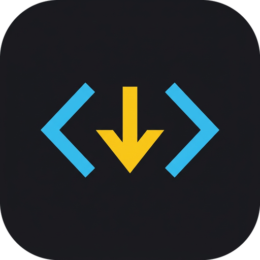

<div align="center">
  
  <h1>Studio Download — Desktop Media Engine</h1>
  <p><strong>Versi 1.0 (v1.0) — High-Performance YouTube & Web Video Engine for Creators and Editors</strong></p>

  <p>
    <a href="https://github.com/EmFaisal-code/Studio-Download/releases"></a>
    <a href="https://www.tiktok.com/@em.n.ef"></a>
    <a href="https://sociabuzz.com/emef/tribe"></a>
    
  </p>

  <p>
    Dibuat oleh <strong><a href="https://www.tiktok.com/@em.n.ef">@em.n.ef</a></strong><br>
    Dukung kreator melalui <strong><a href="https://sociabuzz.com/emef/tribe">SociaBuzz Tribe</a></strong>
  </p>
</div>

---

## 🌟 Fitur Unggulan

- **Ekstraksi YouTube Resolusi Tinggi**: Unduh video hingga kualitas **8K (4320p)**, **4K 60fps**, **2K (1440p)**, dan **1080p Full HD**.
- **Kompatibilitas NLE (Non-Linear Editing)**: Transcode otomatis ke format ramah editor video (**Adobe Premiere Pro**, **DaVinci Resolve**, **Final Cut**) tanpa bug black screen atau desinkronisasi audio.
- **Ekstraksi Audio Studio-Grade**: Konversi dan simpan ke **MP3 320kbps**, **AAC (M4A)**, **FLAC**, **WAV**, **OPUS**.
- **Dukungan Video Streaming & HLS (.m3u8)**: Tangkap dan unduh link video streaming web langsung dengan deteksi otomatis.
- **Ekstensi Browser Pendamping (v1.0)**: Ekstensi Chrome untuk langsung mendeteksi media di tab browser aktif dan mengirimkannya ke aplikasi dengan satu klik.
- **Dukungan Bilingual (ID / EN)**: Beralih secara instan antara **Bahasa Indonesia** dan **English** dengan dukungan kamus lengkap.
- **Tema Visual IDE & Cyber Yellow**: Desain minimalis terinspirasi Vercel/Linear dengan opsi tema **Developer Zinc** dan **Cyber Amber Studio**.
- **100% Portable**: Berjalan mandiri tanpa perlu install dependencies tambahan, FFmpeg sudah terpasang langsung di dalam bundle.

---

## 🚀 Cara Menjalankan

### Opsi 1: Menjalankan Versi Portable (.exe)
1. Buka folder `dist/StudioDownload/` (atau unduh file rilis portable dari [GitHub Releases](https://github.com/EmFaisal-code/Studio-Download/releases)).
2. Double-click file **`StudioDownload.exe`**.
3. Aplikasi akan langsung terbuka dalam jendela mandiri (*native desktop window*).

### Opsi 2: Menjalankan dari Source Code (Python)
Pastikan Anda telah menginstal **Python 3.10+** dan FFmpeg pada sistem.

```bash
# 1. Clone repositori
git clone https://github.com/EmFaisal-code/Studio-Download.git
cd Studio-Download

# 2. Install dependensi
pip install -r requirements.txt

# 3. Jalankan aplikasi
python main.py
```

*Jika ingin menjalankan langsung di peramban (web browser) lokal:*
```bash
python main.py --browser
```

---

## 🧩 Memasang Ekstensi Browser (v1.0)

Studio Download dilengkapi ekstensi browser pendamping yang berada di folder `extra/` (atau di folder `Extension/` pada versi portable):

### Cara Cepat via Software (Rekomendasi):
1. Buka menu **Pengaturan** (`CONFIG`) di pojok kanan atas software.
2. Buka tab **[04] Ekstensi Browser**.
3. Klik tombol **"Buka Folder Ekstensi"** (otomatis membuka lokasi `extra` di Windows Explorer).
4. Di Google Chrome / Brave / Edge, buka `chrome://extensions`, aktifkan **Developer mode**, lalu klik **Load unpacked** dan pilih folder `extra` tersebut!

---

## 🔄 Cara Cek Pembaruan & Update Sendiri

Pengguna dapat selalu memperbarui software ke versi terbaru secara mandiri melalui:

1. **Melalui Tombol di Aplikasi**:
   - Klik tombol **GitHub** di header aplikasi atau tombol **Cek Update** di footer aplikasi untuk langsung diarahkan ke halaman rilis: [https://github.com/EmFaisal-code/Studio-Download/releases](https://github.com/EmFaisal-code/Studio-Download/releases)
2. **Melalui Halaman Rilis GitHub**:
   - Kunjungi: **[https://github.com/EmFaisal-code/Studio-Download/releases](https://github.com/EmFaisal-code/Studio-Download/releases)**
   - Unduh zip versi rilis terbaru, ekstrak, dan jalankan `StudioDownload.exe`.
3. **Untuk Pengguna Git / Developer**:
   ```bash
   git pull origin main
   ```

---

## 📂 Struktur Repositori

```
Studio-Download/
├── extra/                  # Ekstensi browser Chrome / Edge pendamping (v1.0)
│   ├── manifest.json       # Manifest v3 ekstensi
│   ├── bg.js               # Background service worker & IPC
│   ├── images/             # Ikon ekstensi tema Studio Download
│   └── js/                 # Content scripts & capture hooks
├── backend/                # Backend Core Engine (FastAPI & yt-dlp)
│   ├── app.py              # REST API & WebSocket server
│   ├── downloader.py       # Engine unduhan multi-thread & muxer FFmpeg
│   ├── parser.py           # Parser metadata, format, dan playlist
│   ├── config.py           # Konfigurasi sistem & user profile registry
│   └── history.py          # Manajemen riwayat unduhan
├── frontend/               # UI Antarmuka Aplikasi Desktop
│   ├── index.html          # Halaman utama aplikasi & modal dialogs
│   ├── style.css           # Styling IDE minimalism & Cyber Yellow
│   ├── app.js              # Logika frontend & real-time monitoring
│   ├── i18n.js             # Engine multibahasa (ID & EN)
│   └── static/             # Ikon, logo, dan favicon
├── app_icon.ico            # Ikon aplikasi desktop Windows
├── app_icon.png            # Ikon visual resolusi tinggi
├── build_portable.py       # Script otomatis build PyInstaller portable
├── main.py                 # Titik masuk aplikasi (Desktop & Browser)
├── requirements.txt        # Dependensi Python
└── README.md               # Dokumentasi lengkap
```

---

## ☕ Dukungan & Donasi

Jika Anda merasa Studio Download bermanfaat untuk kebutuhan konten dan editing Anda, dukung pengembangannya melalui:

- 💸 **SociaBuzz Tribe**: [https://sociabuzz.com/emef/tribe](https://sociabuzz.com/emef/tribe)
- 📱 **TikTok**: [@em.n.ef](https://www.tiktok.com/@em.n.ef)
- 💻 **GitHub Releases**: [https://github.com/EmFaisal-code/Studio-Download/releases](https://github.com/EmFaisal-code/Studio-Download/releases)

---

<div align="center">
  <sub>Studio Download © 2026. Made with ❤️ by <strong>@em.n.ef</strong></sub>
</div>
